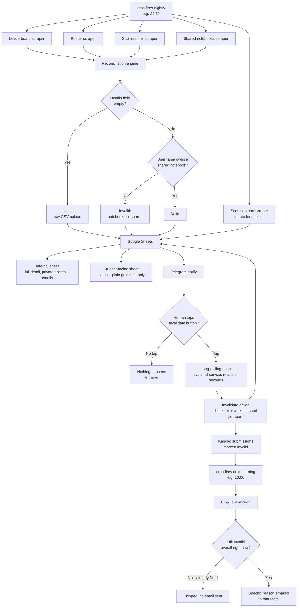

# Kaggle InClass Submission Validator

Automates verification of Kaggle InClass competition submissions against a
notebook-based submission policy: every scored entry must come from a
Kaggle Notebook (via "Submit from Notebook") that has been explicitly
shared with the host account - not a raw CSV upload, and not a notebook
that exists but was never shared.

Built for a course/masterclass setting where dozens of students submit to
a private competition and manually checking each one (leaderboard ->
submission details -> shared notebooks -> cross-reference) doesn't scale.

## What it does

1. **Scrapes** the competition leaderboard, team roster, every team's
   submission history, and the list of notebooks shared with the host
   account (Kaggle exposes none of this via a stable public API, so this
   uses Playwright browser automation against the actual UI).
2. **Reconciles** every scored submission against the policy: raw CSV ->
   invalid; notebook-sourced but not shared -> invalid; notebook-sourced
   and shared -> valid. Walks a team's *entire* submission history (not
   just their current best) to find their true effective valid score,
   since an invalid current-best can mask a legitimate earlier submission.
3. **Logs** results to two separate Google Sheets (opened by ID, not
   name, for robustness) - one internal (full detail: private scores,
   exact reasons, submission IDs to invalidate, plus student emails
   pulled from Kaggle's own scores export) and one safe to share with
   students (status + plain-English guidance only, no scores, no
   internal IDs, no emails).
4. **Notifies** via a Telegram bot with a tap-to-confirm button - review
   the day's flagged submissions from your phone, tap, and a persistent
   long-polling service reacts within seconds, invalidating exactly
   those submissions on Kaggle automatically.
5. **Emails** each genuinely-still-invalid team the next morning with
   the specific, accurate reason their submission was flagged - cross-
   checked against that team's *current* overall status first, so a team
   whose only invalid submission was an old one already cleaned up never
   gets a misleading "action needed" message.
6. **Runs unattended** on a schedule (cron/systemd) so the whole loop -
   scrape, reconcile, log, notify, invalidate, email - happens every day
   with zero manual intervention, with a human approval step (the
   Telegram tap) before anything irreversible actually happens.

## Flow diagram



## Architecture

```
scrapers/                     Playwright scrapers (leaderboard, roster, submissions,
                               shared notebooks, scores export for emails)
engine/                        Reconciliation logic - pure Python, no browser needed
output/                        Google Sheets logging (opened by ID) + email lookup helpers
notify/                        Telegram notify, long-polling poller, email automation
actions/                       The actual invalidation action (checkbox + click, batched per team)
auth/                          Session management: one-time login, verify (local + cloud),
                               export session for cloud deployment
config.py                      Competition URL, paths, settings
run_daily.py                   Orchestrator - chains every step with one pinned date
telegram-poller.service        systemd unit for the always-on, instant-reaction poller
.env.example                   Template for Telegram + email credentials
```

### Why browser automation instead of an API

Kaggle doesn't expose a public API for: per-submission Details text
(notebook vs. raw CSV), the list of notebooks shared with an account, or
per-submission state. All of this only exists in the web UI, so this
project scrapes it directly with Playwright, using the same DOM structure
Kaggle's own React app renders (MUI DataGrid / MUI List components).

### Two auth modes, auto-detected

- **Local (Windows)**: a dedicated, manually-authenticated Chrome profile.
  Necessary because Google's OAuth actively blocks automated login
  attempts - so login happens once, by hand (`auth/login_and_save_session.py`
  opens a real, persistent Chrome profile for this), and Playwright just
  reuses that session afterward. Re-run it whenever the session expires.
- **Cloud (Linux/headless)**: a portable exported session
  (`kaggle_session.json`), generated from the already-authenticated local
  Chrome profile via `auth/export_session_for_cloud.py`, then `scp`'d to
  the server. This avoids needing to solve the Google-OAuth-blocks-
  automation problem a second time on a headless server.

`auth/browser_context.py` auto-detects which one is available and uses it
- the rest of the codebase doesn't need to know or care which environment
it's running in. Verify either side is still logged in with
`auth/verify_session.py` (local) or `auth/verify_cloud_session.py` (cloud).

## Setup

### 1. Install dependencies
```bash
python -m venv venv
venv\Scripts\activate      # Windows
# source venv/bin/activate  # Linux/Mac
pip install -r requirements.txt
playwright install --with-deps chromium
playwright install chrome   # only needed for the local Windows auth path
```

### 2. Configure the competition
Edit `config.py`:
```python
COMPETITION_URL = "https://www.kaggle.com/competitions/your-competition-slug"
```

### 3. Set up authentication

**Local (Windows) - do this first, even if you plan to deploy to cloud:**
```bash
python auth/login_and_save_session.py
```
This opens a real, persistent Chrome window (stored at
`CHROME_USER_DATA_DIR` in `config.py`). Log into Kaggle by hand in that
window (as whichever account should host the competition), handle any
2FA yourself, then press Enter in the terminal once you're in - the login
is saved directly into that Chrome profile folder, no separate export
needed for local use. Verify it stuck:
```bash
python auth/verify_session.py
```

**Cloud deployment (optional):** export a portable session from the
already-authenticated local profile, then upload it to your server:
```bash
python auth/export_session_for_cloud.py
# uploads kaggle_session.json to the server's project root
```

### 4. Set up Google Sheets logging
1. Create a Google Cloud project, enable the Sheets and Drive APIs
2. Create a service account, download its JSON key as `service_account.json`
   in the project root (excluded via `.gitignore` - never commit this)
3. Create **two** blank Google Sheets:
   - one for internal use (private scores, full detail, student emails)
   - one safe to share with students (status + guidance only)
4. Share both with the service account's email (found in the JSON key,
   or the Cloud Console) with Editor access
5. Update `SHEET_ID` / `STUDENT_SHEET_ID` in `output/sheets_logger.py`
   with each Sheet's ID (opened by ID, not name, for robustness - grab
   it from the Sheet's URL: `docs.google.com/spreadsheets/d/THIS_PART/edit`)

### 5. Set up Telegram notifications
1. Message `@BotFather` on Telegram, send `/newbot`, follow the prompts
2. Message `@userinfobot` to get your own chat ID
3. Copy `.env.example` to `.env` and fill in both values (never commit `.env`)
4. The actual tap-to-confirm reaction runs as an always-on long-polling
   service (`notify/telegram_poller.py`), not a periodic cron check - see
   the systemd setup in step 7 for instant (~seconds) reaction to a tap.

### 6. Set up email automation (optional)
Emails the specific, accurate invalidation reason to each genuinely-
still-invalid team the morning after a tap-confirmed invalidation run -
skipping any team whose current overall status is actually fine.
1. For Gmail: enable 2-Step Verification, then generate an App Password
   at `myaccount.google.com/apppasswords`
2. Add `EMAIL_ADDRESS`, `EMAIL_APP_PASSWORD`, `EMAIL_SMTP_SERVER`,
   `EMAIL_SMTP_PORT` to your `.env` (see `.env.example`)
3. Test delivery (and spam-folder placement) without touching real data:
   ```bash
   python notify/email_students.py --test-email you@example.com
   ```
> Note: many organizational (Microsoft 365/Outlook) accounts have SMTP
> AUTH disabled by IT policy even when the account works fine otherwise -
> if you hit an auth error there, use a personal Gmail account instead.

### 7. Run it
```bash
python scrapers/leaderboard_scraper.py
python scrapers/teams_roster_scraper.py
python scrapers/submissions_scraper.py
python scrapers/shared_notebooks_scraper.py
python scrapers/download_scores_export.py
python engine/reconciliation.py
python output/sheets_logger.py
python notify/telegram_notify.py
```
Or all at once (same chain, pinned to one date):
```bash
python run_daily.py
```
Then, the morning after a night you've tapped "Invalidate" in Telegram:
```bash
python notify/email_students.py --apply
```

### 8. (Optional) Deploy to AWS EC2 for unattended cloud operation

Running this on your own machine means it only works while your machine is
on. Moving it to a small always-on cloud server removes that dependency
entirely.

**Launch the instance:**
1. EC2 Console -> Launch instance
2. AMI: **Ubuntu Server** (22.04 or 24.04 LTS, "Free tier eligible")
3. Instance type: `t2.micro` or `t3.micro` (free tier)
4. Create a new key pair, `.pem` format - **only downloads once, keep it safe**
5. Network settings -> "Allow SSH traffic from" -> **My IP** (not "Anywhere")
6. Launch, then note the instance's **Public IPv4 address**

**Connect via SSH** (Windows has this built in, PowerShell):
```powershell
cd $HOME\Downloads
icacls.exe your-key.pem /reset
icacls.exe your-key.pem /grant:r "$($env:USERNAME):(R)"
icacls.exe your-key.pem /inheritance:r
ssh -i "your-key.pem" ubuntu@YOUR_PUBLIC_IP
```
> **Gotcha**: if you switch WiFi networks later, your public IP changes,
> and the security group will start rejecting your connection (times out,
> doesn't refuse). Fix: EC2 Console -> Security tab -> edit the security
> group's inbound rule -> set source back to **My IP** again.

**Install everything on the server:**
```bash
sudo apt update && sudo apt upgrade -y
sudo apt install -y python3 python3-pip python3-venv unzip

mkdir ~/kaggle-validator && cd ~/kaggle-validator
python3 -m venv venv
source venv/bin/activate
pip install -r requirements.txt
playwright install --with-deps chromium
```

**Deploy your code** (from Windows, excluding local-only folders):
```powershell
cd C:\Users\you\Downloads
mkdir kaggle-validator-deploy
robocopy kaggle-validator kaggle-validator-deploy /E /XD venv chrome-profile __pycache__ data
Compress-Archive -Path kaggle-validator-deploy -DestinationPath deploy.zip -Force
scp -i "your-key.pem" deploy.zip ubuntu@YOUR_PUBLIC_IP:~/
```
Then on the server:
```bash
cd ~
unzip -o deploy.zip
cp -r kaggle-validator-deploy/. ~/kaggle-validator/
rm -rf kaggle-validator-deploy deploy.zip
```

Upload your `.env`, `service_account.json`, and `kaggle_session.json`
(generated locally via `auth/export_session_for_cloud.py`) the same way -
these are gitignored, so `git clone` alone won't bring them over; `scp`
them directly instead. `.env` now also carries your email credentials
(see step 6), so there's nothing extra to upload separately for that.

**Set the correct timezone** (EC2 defaults to UTC, which will fire your
cron jobs at the wrong local time):
```bash
sudo timedatectl set-timezone Asia/Kolkata   # adjust to your timezone
```

**Set up the Telegram poller as a systemd service** (not cron - this
needs to be always-running and long-polling, not triggered every few
minutes, so it reacts to your tap in seconds instead of up to 5 minutes
later):
```bash
sudo cp telegram-poller.service /etc/systemd/system/
sudo systemctl daemon-reload
sudo systemctl enable telegram-poller.service
sudo systemctl start telegram-poller.service
```
Check it's actually running with `sudo systemctl status telegram-poller.service`.
If you changed the project folder name or path, edit
`telegram-poller.service`'s `WorkingDirectory` and `ExecStart` lines to
match before copying it over.

**Schedule the nightly run and the morning email pass:**
```bash
crontab -e
```
```
59 23 * * * cd /home/ubuntu/kaggle-validator && venv/bin/python run_daily.py >> logs/cron.log 2>&1
0 9 * * * cd /home/ubuntu/kaggle-validator && venv/bin/python notify/email_students.py --apply >> logs/email_cron.log 2>&1
```
(Adjust `0 9 * * *` to whatever time you want students emailed the
morning after a tap-confirmed invalidation.)

From here it runs itself, every night, with no machine of yours needing
to be on at all - you can close every terminal, shut down your laptop,
and the server keeps going independently.

### 9. (Optional) Schedule it locally instead

If you'd rather keep everything on your own machine:
- **Windows**: Task Scheduler -> Create Task -> Trigger: Daily at your
  chosen time -> Action: Start a program -> point to your venv's
  `python.exe`, with argument `run_daily.py`, "Start in" set to the
  project folder
- **Linux/Mac**: same `crontab` approach as above, just running locally
  instead of on a cloud instance

Note this only runs while the machine is powered on and awake - the AWS
approach above removes that constraint entirely.

## Safety design

Invalidation is the one irreversible action in this system (Kaggle has no
"undo" for it), so it's treated differently from everything else:

- `actions/invalidate_submissions.py` defaults to a dry run - nothing
  happens without an explicit `--apply` flag
- With `--apply`, it prints the exact team-by-team, submission-ID-by-
  submission-ID breakdown and requires typing `CONFIRM` before doing
  anything, unless triggered via a Telegram tap (`--no-prompt`), where the
  tap itself serves as the human approval
- Every submission is checked individually against the policy - a team
  with 10 invalid raw-CSV attempts and 1 legitimate notebook submission
  only has the 10 bad ones flagged, never the valid one
- Already-invalidated submissions are recognized and skipped, not
  re-flagged as new problems forever
- A day's date is pinned once at the very start of a run and passed
  explicitly through every step, so a run that happens to cross midnight
  can't end up with mismatched files between steps
- Before sending any email, `notify/email_students.py` re-checks that
  team's *current* overall status - if they've since fixed things and
  the only invalid submission was already cleaned up, that team is
  skipped rather than emailed about a problem that's no longer real

## What's NOT included / gitignored on purpose

- `data/` - contains real student names, emails, and scores; regenerated
  fresh by the scrapers each run
- `.env`, `service_account.json`, `kaggle_session.json` - real credentials
- `chrome-profile/`, `venv/` - local-machine-specific, not portable

## License

MIT - see LICENSE.

### Build By TOTZ With Ego 
